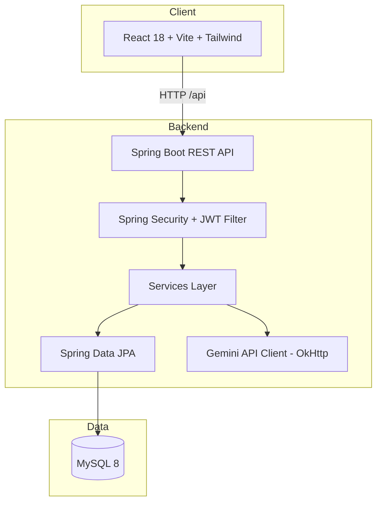

<div align="center">

# SkillBridge

### AI-Powered Placement Preparation Platform

**Practice company-wise · Get Gemini feedback · Track weak areas · Measure readiness · Generate study plans**

<br/>

[](https://openjdk.org/)
[](https://spring.io/projects/spring-boot)
[](https://react.dev/)
[](https://www.mysql.com/)
[](https://ai.google.dev/)
[](LICENSE)

[Features](#-features) · [Architecture](#-architecture) · [Quick Start](#-quick-start) · [API](#-api-overview) · [Docker](#-docker) · [Contributing](CONTRIBUTING.md)

</div>

---

## Overview

**SkillBridge** is a full-stack placement preparation platform built for engineering students targeting campus drives. Instead of scattered PDFs and random LeetCode sessions, students get a **structured, company-focused workflow** with measurable progress.

| Challenge | SkillBridge solution |
|-----------|----------------------|
| Random preparation | Company-wise question banks (TCS, Infosys, Wipro, Zoho, Amazon, Accenture, Cognizant, Capgemini) |
| No feedback on written answers | **Google Gemini** evaluates answers with score, gaps, and model response |
| Unknown weak topics | Automatic **topic-level** strength tracking (WEAK / MEDIUM / STRONG) |
| Unclear job readiness | **Readiness score** (0–100) per company with weighted formula |
| No study direction | AI-generated **3 / 5 / 7-day** personalized study plans |

---

## Features

- **Authentication** — JWT-based stateless auth, BCrypt (12 rounds), role support (`STUDENT`, `ADMIN`)
- **Company catalog** — 8 companies seeded with real test patterns and package ranges
- **Question bank** — 60+ questions across Aptitude, SQL, Java, DSA, HR (MCQ, TEXT, CODE, SQL types)
- **Practice mode** — Submit answers, view history, track per-topic progress
- **AI feedback** — Structured Gemini prompts return JSON: score, feedback, missing points, improved answer
- **Dashboard** — Accuracy, category breakdown, weak/strong areas, recent activity, streak
- **Study plans** — Personalized multi-day plans based on weak areas and target company
- **API docs** — Swagger UI via SpringDoc OpenAPI 3
- **Production-ready layout** — Docker Compose stack (MySQL + Spring Boot + Nginx/React)

---

## Architecture



### Request flow (authenticated)

1. User logs in → `AuthService` issues JWT (24h expiry).
2. `JwtAuthenticationFilter` validates token on each request.
3. Controllers delegate to services; JPA persists attempts and progress.
4. AI endpoints build prompts via `PromptBuilder` → Gemini → parsed JSON stored in `ai_feedback`.

---

## Tech Stack

| Layer | Technologies |
|-------|----------------|
| **Backend** | Java 21, Spring Boot 3.2.5, Spring Security, Spring Data JPA, Validation |
| **Auth** | JWT (jjwt), BCrypt password hashing |
| **Database** | MySQL 8, Hibernate |
| **AI** | Google Gemini 1.5 Flash (REST) |
| **API docs** | SpringDoc OpenAPI 3 |
| **Frontend** | React 18, Vite 5, Tailwind CSS 3, React Router 6 |
| **UI/UX** | Recharts, Lucide icons, Framer Motion, react-hot-toast |
| **HTTP** | Axios with JWT interceptors |
| **Deploy** | Docker, Docker Compose, Nginx reverse proxy |

---

## Project Structure

```
SkillBridge/
├── backend/
│   ├── src/main/java/com/ganesh/skillbridge/
│   │   ├── config/          # Security, JWT, CORS, OpenAPI
│   │   ├── controller/      # REST endpoints
│   │   ├── dto/             # Request/response models
│   │   ├── entity/          # JPA entities
│   │   ├── repository/      # Spring Data repositories
│   │   ├── service/         # Business logic
│   │   ├── util/            # Seeder, readiness calculator, prompts
│   │   └── exception/       # Global exception handling
│   ├── src/main/resources/
│   │   ├── application.properties
│   │   └── application.properties.example
│   ├── Dockerfile
│   └── pom.xml
├── frontend/
│   ├── src/
│   │   ├── api/             # Axios configuration
│   │   ├── components/      # Navbar, Sidebar, charts, cards
│   │   ├── context/         # Auth context
│   │   ├── pages/           # Home, Dashboard, Practice, AI, etc.
│   │   └── styles/
│   ├── Dockerfile
│   ├── nginx.conf
│   └── package.json
├── .github/workflows/       # CI pipeline
├── docker-compose.yml
├── .env.example
└── README.md
```

---

## Quick Start

### Prerequisites

| Tool | Version |
|------|---------|
| Java JDK | 21+ |
| Maven | 3.9+ |
| Node.js | 20+ |
| MySQL | 8.0+ |
| Gemini API key | [Get free key](https://aistudio.google.com/app/apikey) |

### 1. Clone the repository

```bash
git clone https://github.com/Ganesh2k26/SkillBridge.git
cd SkillBridge
```

### 2. Configure environment

**Option A — Environment variables (recommended)**

```bash
# Windows PowerShell
$env:SPRING_DATASOURCE_PASSWORD="your_mysql_password"
$env:GEMINI_API_KEY="your_gemini_api_key"

# Linux / macOS
export SPRING_DATASOURCE_PASSWORD=your_mysql_password
export GEMINI_API_KEY=your_gemini_api_key
```

**Option B — Local properties file**

Copy the example and edit values (file is gitignored):

```bash
cp backend/src/main/resources/application.properties.example backend/src/main/resources/application-local.properties
```

Then run with profile `local` or add to your IDE run configuration.

**Option C — Docker**

```bash
cp .env.example .env
# Edit .env and set GEMINI_API_KEY
```

### 3. Create the database

```sql
CREATE DATABASE IF NOT EXISTS skillbridge_db;
```

Default JDBC URL (if unset): `jdbc:mysql://localhost:3306/skillbridge_db`

### 4. Run the backend

```bash
cd backend
mvn spring-boot:run
```

| URL | Description |
|-----|-------------|
| http://localhost:8080 | API base |
| http://localhost:8080/swagger-ui.html | Swagger UI |
| http://localhost:8080/api/auth/health | Health check |

On first startup, **seed data** loads 8 companies and 60+ questions (`app.seed-data=true`).

### 5. Run the frontend

```bash
cd frontend
npm install
npm run dev
```

Open **http://localhost:5173** — Vite proxies `/api` to port 8080.

### Demo credentials

| Role | Email | Password |
|------|-------|----------|
| Admin (seeded) | `admin@skillbridge.dev` | `admin123` |

Register a new student account from the UI to set your target company and profile.

---

## Docker

Run the full stack with one command:

```bash
cp .env.example .env
# Set GEMINI_API_KEY in .env

docker compose up --build
```

| Service | URL |
|---------|-----|
| Frontend (Nginx) | http://localhost:3000 |
| Backend API | http://localhost:8080 |
| MySQL | `localhost:3306` |

---

## API Overview

All protected routes require header: `Authorization: Bearer <token>`

### Authentication

| Method | Endpoint | Auth | Description |
|--------|----------|------|-------------|
| `POST` | `/api/auth/register` | Public | Register student |
| `POST` | `/api/auth/login` | Public | Login, returns JWT |
| `GET` | `/api/auth/health` | Public | Service health |

### Companies & questions

| Method | Endpoint | Description |
|--------|----------|-------------|
| `GET` | `/api/companies` | List all companies |
| `GET` | `/api/companies/{id}` | Company details |
| `GET` | `/api/questions/company/{id}` | Filter by `category`, `difficulty` |
| `GET` | `/api/questions/{id}` | Single question |
| `POST` | `/api/questions` | Add question (admin use) |

### Practice & dashboard

| Method | Endpoint | Description |
|--------|----------|-------------|
| `POST` | `/api/practice/submit` | Submit answer |
| `GET` | `/api/practice/history` | User attempt history |
| `GET` | `/api/dashboard/summary` | Full analytics dashboard |
| `GET` | `/api/dashboard/readiness/{companyId}` | Readiness score + label |

### AI

| Method | Endpoint | Description |
|--------|----------|-------------|
| `POST` | `/api/ai/feedback` | AI-evaluate an answer |
| `GET` | `/api/ai/feedback` | Past feedback list |
| `POST` | `/api/ai/study-plan` | Generate study plan |
| `GET` | `/api/ai/study-plans` | User's saved plans |

Full interactive docs: **Swagger UI** at `/swagger-ui.html`.

---

## Database Schema

| Table | Purpose |
|-------|---------|
| `users` | Accounts, roles, target company, profile |
| `companies` | Company metadata and test patterns |
| `questions` | Question bank per company |
| `practice_attempts` | Submitted answers and results |
| `topic_progress` | Per-user topic accuracy and strength |
| `ai_feedback` | Gemini evaluation history |
| `study_plans` | Generated study plan content |

---

## Readiness Score

Placement readiness is computed in `ReadinessScoreCalculator`:

```
Readiness = Practice Completion (40%)
          + Accuracy         (30%)
          + Consistency      (20%)   ← streak days, max at 7 days
          + AI Engagement    (10%)   ← feedback count, max at 5
```

| Score | Label |
|-------|-------|
| 85+ | Excellent — Ready to apply! |
| 70–84 | Good — Minor gaps remain |
| 50–69 | Average — Focused revision needed |
| 30–49 | Below Average — Consistent practice required |
| &lt;30 | Beginner — Start from basics |

**Topic strength:** accuracy ≥ 75% → STRONG · 45–74% → MEDIUM · &lt;45% → WEAK

---

## Configuration Reference

| Variable | Description | Default |
|----------|-------------|---------|
| `SPRING_DATASOURCE_URL` | JDBC URL | `localhost:3306/skillbridge_db` |
| `SPRING_DATASOURCE_USERNAME` | DB user | `root` |
| `SPRING_DATASOURCE_PASSWORD` | DB password | `changeme` |
| `JWT_SECRET` | HMAC secret (256+ bits recommended) | built-in dev default |
| `JWT_EXPIRATION` | Token TTL (ms) | `86400000` (24h) |
| `GEMINI_API_KEY` | Google AI API key | *(empty — AI falls back gracefully)* |
| `APP_SEED_DATA` | Seed companies on startup | `true` |

> **Security:** Never commit real passwords or API keys. Use `.env` (Docker) or environment variables (local). See [SECURITY.md](SECURITY.md).

---

## Interview Talking Points

**Problem solved**  
Students prepare without company context or measurable readiness. SkillBridge centralizes company-specific prep with AI feedback and analytics.

**JWT flow**  
Login → `JwtService` signs HS256 token → `JwtAuthenticationFilter` validates on each request → `SecurityContext` populated → controllers use `@AuthenticationPrincipal`.

**Weak area detection**  
Each practice attempt updates `TopicProgress`. Dashboard aggregates by topic/category and classifies strength from accuracy thresholds.

**AI integration**  
`PromptBuilder` crafts structured prompts; `AiFeedbackService` calls Gemini via OkHttp, parses JSON response, persists to DB. Failures degrade gracefully with a fallback message.

**Why Spring Data JPA**  
Reduces boilerplate, maps entity relationships (`@ManyToOne`, etc.), supports custom `@Query` when needed.

---

## Roadmap

- [ ] Admin panel for question CRUD
- [ ] Email verification and password reset
- [ ] Leaderboard and peer comparison
- [ ] Mock timed tests per company
- [ ] Unit & integration test suite expansion

---

## Free Deployment

The project is now prepared for free hosting with:

- Frontend on GitHub Pages via the workflow in [.github/workflows/deploy-pages.yml](.github/workflows/deploy-pages.yml)
- Backend on Render using [render.yaml](render.yaml)

### Deployment steps

1. Push these changes to GitHub.
2. In the GitHub repository, enable GitHub Pages from the Settings tab.
3. Create a Render web service from the repository and let it deploy the backend.
4. Update the frontend API URL in the workflow or repository variable named `VITE_API_URL` to your Render backend URL.

Example backend URL format:

```text
https://your-app-name.onrender.com/api
```

---

## Contributing

Contributions are welcome. Please read [CONTRIBUTING.md](CONTRIBUTING.md) before opening a pull request.

---

## Author

**Ganesh** — Full-stack portfolio project demonstrating enterprise patterns: layered architecture, JWT security, AI integration, and containerized deployment.

---

## License

This project is licensed under the [MIT License](LICENSE).

## Screenshots


